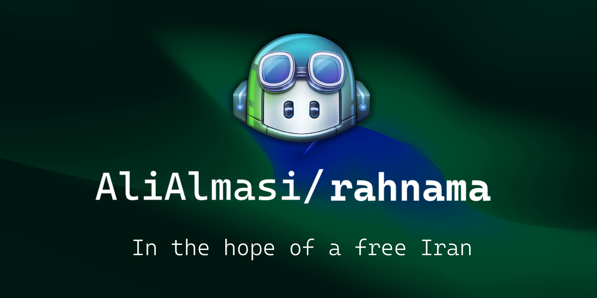

<h4 align="center">⚠️ Attention: This repository is not completed, yet.</h4>

  

 

<h1>râhnamâ (Persian for 'Guide')</h1>
<h3>Simple guide to make your personal v2ray server</h3>
<h4>based on my personal server configurations</h4>

<h2>What's This?</h2>

Recently, people's access to the Internet has been disrupted by the government, and many daily Internet tools such as Instagram and WhatsApp have been cut off.

This guide will help you to make a personal vless/trojan server using a <a href="https://github.com/MHSanaei/3x-ui/">fork (3x-ui)</a> of a popular xray web-panel called <code>x-ui</code> by <a href="https://github.com/vaxilu/x-ui">vaxilu</a>.

Every step on this guide has been checked and the results have been monitorred by myself with my personal server. Don't worry, I will also tell you what kind of server you need to buy and where you should buy it from =D.

<h2>What kinda server should I buy?</h2>

If you have access to payment methods <b>outside Iran</b>, then I recommend you to buy a CX21 (or CPX21) cloud server from <a href="https://www.hetzner.com/cloud#:~:text=5.18%20/%20mo-,CX21,-vCPU">Hetzner</a>

Else, you can buy <b>Ubuntu-based</b> servers from <b>Any VPS provider inside Iran</b>.

The location of the servers should be in European countries (especially Germany and the Netherlands) to have the best speed and less delay to send information to Iran (to you).

<h2>What should I do next?</h2>

You need to Install an ssh client program, to connect to your server's shell and run commands on your server. It is optional so you can install any ssh client you like, (there are also some people who don't use these softwares, they run the <code>ssh</code> command on their terminal).

But, I recommend you to use <a href="https://mobaxterm.mobatek.net/">MobaXterm</a>. It has good features such as password manager (so you don't have to enter password every time), session manager (saving sessions so you don't have to type ssh command every time) and some more helping features like graphical SFTP browser (also available in <em>soft98</em>).

<h2>How does MobaXterm works?</h2>

When you finished installing MobaXterm, you can add your server as an session. Detailed guide of will be on <a href="https://github.com/AliAlmasi/rahnama/wiki/MobaXterm">Wiki</a>.

<h2>Ok, what's next?</h2>

Now we're getting to the exciting parts. Next step is to install the 3x-ui panel on your server.

To do this, the developers of 3x-ui have already made an <code>install.sh</code> script, so youdon't have to install manually. Only thing you need to do is to run this on your server's shell:
<pre><code>bash <(curl -Ls https://raw.githubusercontent.com/mhsanaei/3x-ui/master/install.sh)</code></pre>

Finally, you should see this:

<pre><code>Install/update finished! For security it's recommended to modify panel settings
Do you want to continue with the modification [y/n]? :</code></pre>

This indicates that 3x-ui has installed successfully. Now you got to set the panel's settings.

<ol>
<li>Enter 'y'.</li>
<li>Enter your desired login username.</li>
<li>Enter your desired login password.</li>
<li>Enter your desired port for panel.</li>
</ol>

Now you should see something like this:

<pre><code>Install/update finished! For security it's recommended to modify panel settings
Do you want to continue with the modification [y/n]? :y
Please set up your username:alialmasi
Your username will be:alialmasi
Please set up your password:rahnama
Your password will be:rahnama
Please set up the panel port:8520
Your panel port is:8520
Initializing, please wait...
set username and password success
Account name and password set successfully!
set port 8520 successPanel port set successfully!
Created symlink /etc/systemd/system/multi-user.target.wants/x-ui.service → /etc/systemd/system/x-ui.service.
x-ui v1.1.4 installation finished, it is running now...

x-ui control menu usages:</code></pre>

Congrats, you have sucessfully installed and configured your 3x-ui panel. Now go to <code>http://YOUR-IP:PORT</code> to see the panel.

<<<<<<< HEAD
<h2>What about "exciting" parts?</h2>

The full step-by-step guide is on the <a href="https://github.com/AliAlmasi/rahnama/wiki/">wiki</a> 
You can ask your questions on the <a href="https://github.com/AliAlmasi/rahnama/issues">issues</a> section. <a href="https://github.com/AliAlmasi/rahnama/discussions">Discussions</a> section are available for you guys.

In the hope of a free Iran.

=======
>>>>>>> e439474b1c43303bf29a6d15daa947909663cb5c
